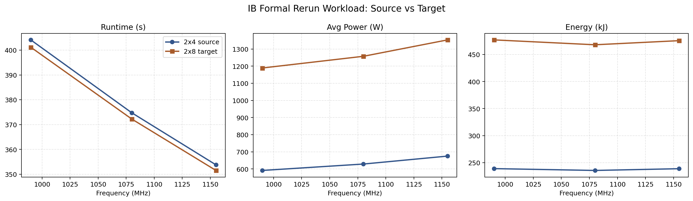
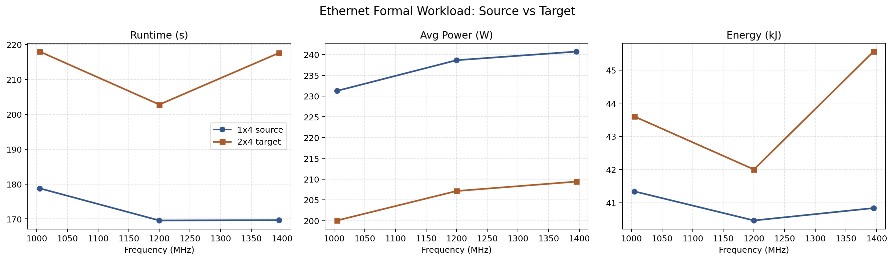
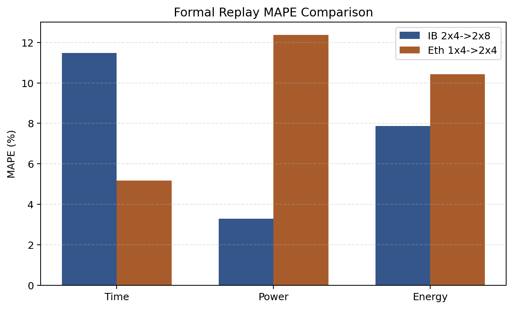

# 实验数据图表总览

## 目的

- 这份文档只整理当前本地 **可直接复核** 的实验图表与 workload 元数据，不继续沿用 PPT 的 headline 写法。
- 进入主图的前提是：`run.json` 中能读到模型结构、数据集路径、train iters、TP/PP/DP、batch、Zeus 指标，以及至少基本可用的 topology 信息。
- 对于缺 baseline、缺 workload 元数据、或明显早于 2026-04 当前代码路径的历史实验，这里不会继续凑图，而是单独列入待补实验。

## 先说清楚的边界

- 当前 **不能** 直接把 IB 和 Ethernet 画成一张“环境优劣”图，因为它们的 workload 本身不同。
- IB formal workload 使用的是 `28L / H3584 / FFN18944 / A28 / KV4`，数据集路径是 `/home/sd/Megatron-DeepSpeed/data/chinese_wiki_megatron_text_document`。
- Ethernet formal workload 的目录标签是 `eth_qwen3b_*`，`run.json` 记录的是 `36L / H2048 / FFN11008 / A16 / KV2`，数据集路径是 `/home/user/Megatron-DeepSpeed/data/qwen_data_text_document`。
- 因此本页的主图只做 **同一 workload 内的 source/target / replay 对比**，不做跨 workload 的强行排名。

## A. 当前可直接入图的 latest-code 实验

### A0. Ethernet 真实模型 baseline/static 补充

说明：这一组不是缩小版 `Qwen-style` workload，而是 **真实 `Qwen2.5-7B-Instruct` checkpoint** 的同拓扑 baseline/static 对照。

| 字段 | baseline | static `1395 MHz` |
| --- | --- | --- |
| Workload 标识 | `Qwen2.5-7B-Instruct`; `28L / H3584 / FFN18944 / A28 / KV4`; `--load qwen25_7b_instruct_hf2megads_tp2pp2_real_main --finetune` | 同左 |
| 节点 x 每节点 GPU | `2 x 4` | `2 x 4` |
| TP / PP / DP / World Size | `2 / 2 / 2 / 8` | `2 / 2 / 2 / 8` |
| Train iters / Seq len | `20 / 2048` | `20 / 2048` |
| Micro / Global batch | `1 / 4` | `1 / 4` |
| Precision | `bf16` | `bf16` |
| Dataset | `/home/user/Megatron-DeepSpeed/data/qwen_data_text_document` | `/home/user/Megatron-DeepSpeed/data/qwen_data_text_document` |
| Tokenizer | `Qwen2.5-7B-Instruct` snapshot `a09a35458c702b33eeacc393d103063234e8bc28` | 同左 |
| Artifact completeness | `hostfile=2, preflight=true, topology=true` | `hostfile=2, preflight=true, topology=true` |
| Representative artifact | `.context/eth_real_qwen25_7b_baseline_static_20260419/artifacts/eth_real_qwen25_7b_tp2pp2dp2_baseline_formal20_finetune_nw0_nosave_fixenv_20260419_sd-1/run.json` | `.context/eth_real_qwen25_7b_baseline_static_20260419/artifacts/eth_real_qwen25_7b_tp2pp2dp2_static1395_formal20_finetune_nw0_nosave_fixenv_20260419_sd-1/run.json` |

| 模式 | Freq (MHz) | Time (s) | Avg Power (W) | Energy (kJ) | Tokens/J | Relative Time | Relative Power | Relative Energy |
| --- | --- | --- | --- | --- | --- | --- | --- | --- |
| baseline | - | 229.49 | 320.18 | 73.48 | 2.230 | 0.00% | 0.00% | 0.00% |
| static | 1395 | 254.42 | 221.63 | 56.39 | 2.906 | +10.86% | -30.78% | -23.26% |

观察：

- 这是当前本地最强的一组 **真实模型主证据**，因为它同时满足 `真实 checkpoint / 真实 7B 架构 / 真实数据集 / 同拓扑公平对照`。
- 两组 run 都使用 `DISABLE_SAVE_CHECKPOINT=1`，这是为规避 `sd-2` 磁盘写满；它不会影响训练窗口内的 `time / power / energy` 指标。
- `1395 MHz` 在真实模型上仍然保留明显的节能收益，但 runtime 代价也比此前缩小版 workload 更清楚地暴露出来，因此后续汇报应把它单列为“真实模型补充证据”，而不是与缩小版 workload 直接混表。

### A1. IB formal rerun workload

说明：`run.json` 中没有独立的模型名称字段，这里用结构参数和 tokenizer 路径标识 workload。

| 字段 | IB source `2x4` | IB target `2x8` |
| --- | --- | --- |
| Workload 标识 | Qwen2.5-style; 28L / H3584 / FFN18944 / A28 / KV4; tokenizer=qwen25_tokenizer_flat | Qwen2.5-style; 28L / H3584 / FFN18944 / A28 / KV4; tokenizer=qwen25_tokenizer_flat |
| 节点 x 每节点 GPU | 2 x 4 | 2 x 8 |
| TP / PP / DP / World Size | 4 / 1 / 2 / 8 | 4 / 1 / 4 / 16 |
| Train iters / Seq len | 20 / 2048 | 20 / 2048 |
| Micro / Global batch | 1 / 8 | 1 / 16 |
| Precision | bf16 | bf16 |
| Dataset | /home/sd/Megatron-DeepSpeed/data/chinese_wiki_megatron_text_document | /home/sd/Megatron-DeepSpeed/data/chinese_wiki_megatron_text_document |
| Data impl / split | mmap / 98,2,0 | mmap / 98,2,0 |
| Tokenizer | /home/sd/Megatron-DeepSpeed/.context/qwen25_tokenizer_flat | /home/sd/Megatron-DeepSpeed/.context/qwen25_tokenizer_flat |
| Artifact completeness | hostfile=2, preflight=true | hostfile=2, preflight=true |
| Representative artifact | .context/ib_formal_rerun_20260410/source/ib_dual8_tp4pp1dp2_formal_990_20260410_20260410_161719_DGX2-1/run.json | .context/ib_formal_rerun_20260410/target_final/ib_dual16_tp4pp1dp4_diag_nozeus_990_20260410_202433_DGX2-1/run.json |

#### IB source/target 曲线图

| Freq (MHz) | Source Time (s) | Source Power (W) | Source Energy (kJ) | Target Time (s) | Target Power (W) | Target Energy (kJ) |
| --- | --- | --- | --- | --- | --- | --- |
| 990 | 404.13 | 591.25 | 238.94 | 401.19 | 1189.17 | 477.08 |
| 1080 | 374.76 | 628.60 | 235.57 | 372.24 | 1257.39 | 468.05 |
| 1155 | 353.79 | 674.96 | 238.79 | 351.53 | 1353.14 | 475.67 |

观察：

- 在这个 latest-code IB workload 下，`2x4` source 和 `2x8` target 的 runtime 曲线非常接近，说明 DP 扩张后时间没有被明显拉长。
- target 平均功率几乎接近 source 的 2 倍，这是 `gpus_per_node` 从 `4 -> 8` 的结构性变化，不应再用旧的 per-node power 假设直接外推。
- 当前 target `990 MHz` 的 artifact 名称虽然带 `diag_nozeus`，但 `run.json.power_metrics.zeus` 实际存在且完整，因此仍可用于 workload 曲线图。

### A2. Ethernet formal workload

| 字段 | Eth source `1x4` | Eth target `2x4` |
| --- | --- | --- |
| Workload 标识 | artifact dir label: eth_qwen3b; 36L / H2048 / FFN11008 / A16 / KV2; tokenizer=a09a35458c702b33eeacc393d103063234e8bc28 | artifact dir label: eth_qwen3b; 36L / H2048 / FFN11008 / A16 / KV2; tokenizer=a09a35458c702b33eeacc393d103063234e8bc28 |
| 节点 x 每节点 GPU | 1 x 4 | 2 x 4 |
| TP / PP / DP / World Size | 1 / 2 / 2 / 4 | 1 / 2 / 4 / 8 |
| Train iters / Seq len | 20 / 2048 | 20 / 2048 |
| Micro / Global batch | 1 / 4 | 1 / 4 |
| Precision | bf16 | bf16 |
| Dataset | /home/user/Megatron-DeepSpeed/data/qwen_data_text_document | /home/user/Megatron-DeepSpeed/data/qwen_data_text_document |
| Data impl / split | mmap / 98,2,0 | mmap / 98,2,0 |
| Tokenizer | /home/user/.cache/huggingface/hub/models--Qwen--Qwen2.5-7B-Instruct/snapshots/a09a35458c702b33eeacc393d103063234e8bc28 | /home/user/.cache/huggingface/hub/models--Qwen--Qwen2.5-7B-Instruct/snapshots/a09a35458c702b33eeacc393d103063234e8bc28 |
| Artifact completeness | hostfile=0, preflight=null | hostfile=2, preflight=null |
| Representative artifact | .context/eth_2x4_curve_eval_20260409/eth_qwen3b_1x4_source_curve_20260409_curated/eth_qwen3b_1x4_source_static1005_20260408_sd-2/run.json | .context/eth_2x4_curve_eval_20260409/eth_qwen3b_2x4_target_curve_20260408_sd-1/eth_qwen3b_2x4_target_static1005_20260408_sd-1/run.json |

#### Ethernet source/target 曲线图

| Freq (MHz) | Source Time (s) | Source Power (W) | Source Energy (kJ) | Target Time (s) | Target Power (W) | Target Energy (kJ) |
| --- | --- | --- | --- | --- | --- | --- |
| 1005 | 178.76 | 231.27 | 41.34 | 217.96 | 200.04 | 43.60 |
| 1200 | 169.55 | 238.65 | 40.46 | 202.78 | 207.14 | 42.00 |
| 1395 | 169.65 | 240.72 | 40.84 | 217.56 | 209.40 | 45.56 |

观察：

- Ethernet source 与 target 都有完整的 `run.json`、模型结构、数据路径、train-iters 和 Zeus 指标，因此可以支撑 workload 级曲线图。
- 这组 artifact 的 target `hostfile` 和 `topology` 是存在的，但 `preflight.ok` 为 `null`，说明它来自手工/半手工 launcher 路径，证据等级略低于 IB formal rerun。
- 尽管如此，这批 run 足以支撑“慢网络 workload 曲线 + replay 精度”的图表展示，但还不足以支撑 baseline vs fixed 的最新对照结论。

### A3. Formal replay 精度对比

| 环境 | Pair | Time MAPE | Power MAPE | Energy MAPE | alpha_dp | Artifact |
| --- | --- | --- | --- | --- | --- | --- |
| IB | 2x4 -> 2x8 (IB, topology-fixed, power-fixed) | 11.48% | 3.28% | 7.86% | 2.220525e-11 s/byte | .context/transfer_eval_ib_2x4_to_2x8_rerun_topology_fixed_live_ib_powerfix_20260411/transfer_prediction_report.md |
| Ethernet | 1x4 -> 2x4 (Ethernet) | 5.16% | 12.38% | 10.42% | 7.321889e-10 s/byte | .context/transfer_eval_eth_qwen3b_1x4_source_curve_20260409_curated_to_eth_qwen3b_2x4_target_curve_20260408_sd-1/transfer_prediction_report.md |

观察：

- 当前最稳的 predictor 精度证据来自 2026-04 的 IB formal rerun 和 Ethernet formal replay。
- IB 的 power / energy 已经收敛得比较好，剩余主要误差在 runtime。
- Ethernet 的 time 已经进入可用范围，但 power 侧仍弱于 IB，因此更适合支撑“network-aware predictor 能迁移到慢网络”，而不是支撑“Ethernet 比 IB 更准”的结论。

## B. 当前不应继续画成主图的历史实验

- `TP=1, PP=4, DP=4` 和 `TP=2, PP=2, DP=4` 这两组 V100 双机案例仍然是重要历史线索，但它们的 baseline 目前主要存在于 `memory-bank/observability.md` 的 preserved summary。
- 本地确实能找到一部分对应的 2026-03 static run，例如：
  - `.context/dual8_generalization_20260326/tp1pp4dp4/*/run.json`
  - `.context/dual8_generalization_20260326/tp2pp2dp4/*/run.json`
- 但这些 run 普遍缺少当前 launcher 时代应有的 `hostfile / topology / freq_policy` 完整信息，且早于 2026-04 的 metadata、continuous alpha scaling 和 power-scaling 修复。
- 因此，这里不再把它们直接纳入最新 workload 图表，只把它们视为“需要在最新代码上重做”的历史候选。

## C. 需要补跑的实验

| 实验项 | 当前状态 | 为什么不能直接入主图 | 建议补跑内容 |
| --- | --- | --- | --- |
| V100 `TP=1, PP=4, DP=4` baseline/static headline 案例 | 仅有 memory-bank preserved baseline summary；本地 2026-03 static run 存在，但 `hostfile/topology/freq_policy` 仍是旧格式或为空 | 缺 baseline 原始 artifact，且现有 static run 早于 2026-04 launcher / metadata / power-scaling 修复，不能当作当前 workload 级主证据 | 在最新 launcher 上补 `baseline + 1252/1260/1267 MHz`，保留 `run.json + events.jsonl + command.sh + ds_config.json + hostfile_snapshot.json + preflight.json` |
| V100 `TP=2, PP=2, DP=4` baseline/static headline 案例 | 只有历史 baseline summary；本地 2026-03 static run `freq_policy` 为 `null` 且 `hostfile={}` | 虽然 summary 数值好看，但 workload 元数据和基线 provenance 不完整，不能继续拿来做当前图表主线 | 在最新 launcher 上补 `baseline + 1072/1080/1087/1125 MHz`，并确保 `freq_policy/topology/hostfile/preflight` 全部非空 |
| IB formal workload 的 baseline 对照 | 当前只有 `2x4` source 和 `2x8` target 的 static 三频 formal 曲线，没有 baseline | 这意味着当前只能做“frequency curve + predictor replay”图，不能做同 workload 下的 baseline vs fixed 对照图 | 补跑 `2x4 TP=4/PP=1/DP=2` baseline 和 `2x8 TP=4/PP=1/DP=4` baseline，各 20 steps，保持数据集和模型不变 |
| Ethernet formal workload 的 baseline 对照 | 当前 `1x4 -> 2x4` 只有 static 三频曲线，没有 baseline；target 是手工 launcher 路径，`preflight` 为空 | 能支撑 predictor replay，但还不够支撑“固定频率优于 baseline”的最新工作负载图表 | 补跑 `1x4` baseline 和 `2x4` baseline，并优先让 launcher 写入完整 `hostfile/topology/preflight` |
| 更多拓扑的 latest-code 覆盖 | 目前最新、元数据完整的 artifact 主要集中在 IB `2x4 -> 2x8` 与 Ethernet `1x4 -> 2x4` | 拓扑覆盖仍偏窄，暂时不能把“跨拓扑稳定有效”写成 workload 级广泛结论 | 优先补一个 IB 额外拓扑和一个 Ethernet 额外拓扑，建议从历史已出现过的 `TP=2, PP=4, DP=2` 和 `TP=2, PP=2, DP=4` 中选 |

## D. 推荐的补实验优先级

1. **先补当前 workload 的 baseline**
   先把 IB formal `2x4 / 2x8` 和 Ethernet formal `1x4 / 2x4` 的 baseline 各补一条。这样马上就能把“predictor 曲线”和“baseline vs fixed”接到同一 workload 上。
2. **再补历史 headline 两个拓扑的 latest-code 重跑**
   也就是 V100 的 `TP=1, PP=4, DP=4` 和 `TP=2, PP=2, DP=4`。这一步的目标不是再追更多频点，而是恢复完整 provenance。
3. **最后补更多 topology 覆盖**
   至少再增加一个 IB topology 和一个 Ethernet topology，才有资格把“跨拓扑有效”写成 workload 级结论。

## 关联 artifacts

- IB source formal runs:
  - `.context/ib_formal_rerun_20260410/source/ib_dual8_tp4pp1dp2_formal_990_20260410_20260410_161719_DGX2-1/run.json`
  - `.context/ib_formal_rerun_20260410/source/ib_dual8_tp4pp1dp2_formal_1080_20260410_20260410_162533_DGX2-1/run.json`
  - `.context/ib_formal_rerun_20260410/source/ib_dual8_tp4pp1dp2_formal_1155_retry_20260410_170335_DGX2-1/run.json`
- IB target formal runs:
  - `.context/ib_formal_rerun_20260410/target_final/ib_dual16_tp4pp1dp4_diag_nozeus_990_20260410_202433_DGX2-1/run.json`
  - `.context/ib_formal_rerun_20260410/target_final/ib_dual16_tp4pp1dp4_formal_1080_20260411_110907_DGX2-1/run.json`
  - `.context/ib_formal_rerun_20260410/target_final/ib_dual16_tp4pp1dp4_formal_1155_20260411_111702_DGX2-1/run.json`
- Ethernet source formal runs:
  - `.context/eth_2x4_curve_eval_20260409/eth_qwen3b_1x4_source_curve_20260409_curated/eth_qwen3b_1x4_source_static1005_20260408_sd-2/run.json`
  - `.context/eth_2x4_curve_eval_20260409/eth_qwen3b_1x4_source_curve_20260409_curated/eth_qwen3b_1x4_source_static1200_20260408_sd-2/run.json`
  - `.context/eth_2x4_curve_eval_20260409/eth_qwen3b_1x4_source_curve_20260409_curated/eth_qwen3b_1x4_source_static1395_r1_20260409_sd-2/run.json`
- Ethernet target formal runs:
  - `.context/eth_2x4_curve_eval_20260409/eth_qwen3b_2x4_target_curve_20260408_sd-1/eth_qwen3b_2x4_target_static1005_20260408_sd-1/run.json`
  - `.context/eth_2x4_curve_eval_20260409/eth_qwen3b_2x4_target_curve_20260408_sd-1/eth_qwen3b_2x4_target_static1200_20260408_sd-1/run.json`
  - `.context/eth_2x4_curve_eval_20260409/eth_qwen3b_2x4_target_curve_20260408_sd-1/eth_qwen3b_2x4_target_static1395_20260408_sd-1/run.json`
- IB replay report: `.context/transfer_eval_ib_2x4_to_2x8_rerun_topology_fixed_live_ib_powerfix_20260411/transfer_prediction_report.md`
- Ethernet replay report: `.context/transfer_eval_eth_qwen3b_1x4_source_curve_20260409_curated_to_eth_qwen3b_2x4_target_curve_20260408_sd-1/transfer_prediction_report.md`

## 结论

- 当前真正适合做 workload 级图表的，是 2026-04 的 IB formal rerun、Ethernet formal replay，以及新增的 Ethernet **真实 Qwen2.5-7B-Instruct** baseline/static 补充工件。
- 真实模型 baseline/static 现在已经有首组 artifact-backed 证据，但仍只有一个固定频点；因此它更适合单列成“真实模型补充页”，暂时还不能替代更完整的 latest-code sweep。
- 对于 headline 级大范围 baseline/static 叙事，依然不应该继续只靠历史 summary 或旧 metadata；下一步仍应优先补齐缺失的 baseline、关键拓扑，以及 real-model 的更多固定频点。
